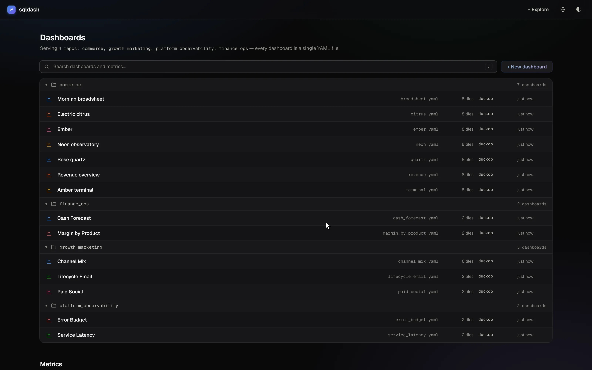
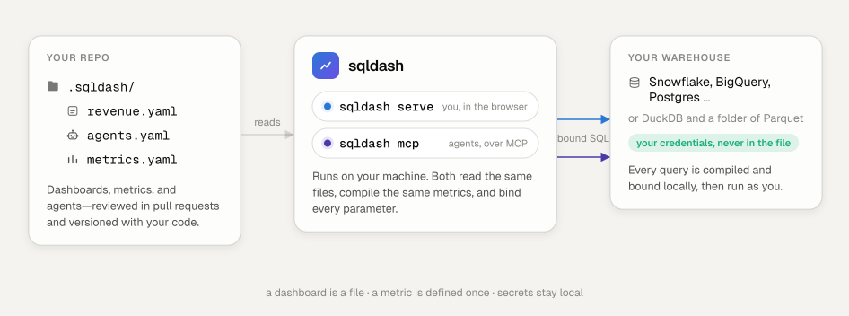
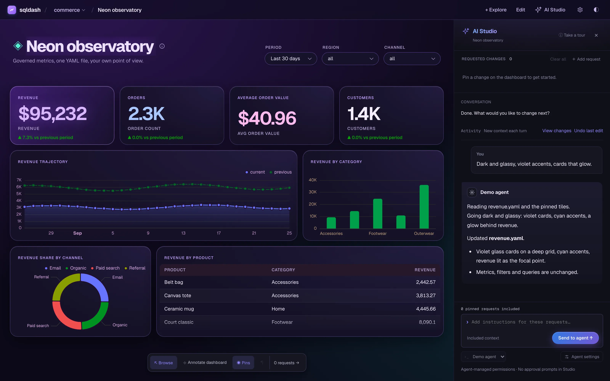

<h4 align="center">
  <a href="https://sqldash.dev">
    <picture>
      <source media="(prefers-color-scheme: dark)" srcset="assets/wordmark-dark.svg">
      
    </picture>
  </a>
  <br>
  BI for the agentic era
</h4>

<p align="center">
  <a href="https://github.com/dylan-murray/sqldash/actions/workflows/tests.yml"></a>
  <a href="https://github.com/dylan-murray/sqldash/actions/workflows/codeql.yml"></a>
  <a href="https://github.com/dylan-murray/sqldash/actions/workflows/semgrep.yml"></a>
  <a href="https://github.com/dylan-murray/sqldash/blob/main/pyproject.toml"></a>
  <a href="LICENSE"></a>
</p>

<h2></h2>

sqldash serves dashboards and metrics straight from your repos. Work with every
dashboard and metric from a local CLI. Dashboards run locally on your machine. No
infrastructure to stand up and no complicated deployments. Agents build dashboards
quickly through the CLI or MCP server and can self-serve business questions the same way.



## 💡 Why sqldash

Most BI tools keep your dashboards on their server, behind their login, in their
editor. sqldash keeps them in your repo as YAML, with the same review, the same
history, and the same deploy as the rest of your code.

- **Local first.** Pure Python, no cloud, no build step. A small server on your machine,
  nothing hosted, nothing to sign up for.
- **Dashboards as code.** One YAML file per dashboard. The browser is an editor over
  that file: add a tile, change a chart, adjust a filter, or drag the layout, and
  sqldash writes the YAML back, so the change shows up as a normal diff in git.
- **Edit with your coding agent.** Pin a change in AI Studio, choose Claude Code,
  Codex, or your own entrypoint, and keep chatting as the dashboard updates. Undo
  the latest edit when you want to try another direction.
- **Metrics as code.** Define revenue once. Tiles, the CLI, and agents all use that
  definition, and nobody re-derives it in raw SQL.
- **Most SQL databases.** Flat, human config for Snowflake, BigQuery, Databricks,
  Redshift, Athena, Postgres, MySQL, Trino, ClickHouse, SQLite, and DuckDB, or a raw
  SQLAlchemy URL for anything else SQLAlchemy speaks. One dashboard can pull from
  several at once. `sqldash lint` catches typos and missing drivers before you serve.
- **Credentials stay local.** Use `${env:VAR}` references or a per-user profile
  to keep credentials outside committed dashboard files. Everyone connects as themselves.
- **Built for agents too.** `sqldash mcp` serves governed metrics to Claude Code and
  friends. Agents pass names and values; sqldash compiles the SQL.

<picture>
  <source media="(prefers-color-scheme: dark)" srcset="assets/how-it-works-dark.svg">
  
</picture>

## 🚀 Quick start

Try the demo. It runs on DuckDB, so there is nothing to connect:

```bash
uvx sqldash init --demo   # sample dashboard and metrics in .sqldash/
uvx sqldash serve         # opens the dashboard in your browser
```

Once you're ready for your own warehouse, `setup` does the onboarding. It asks which
warehouse you use, writes a local profile with your credentials, tests the connection,
and writes the project source:

```bash
uvx sqldash setup         # pick a warehouse, write a profile, test the connection
uvx sqldash serve
```

Then prompt your agent to build the dashboards. `sqldash mcp` hands it your schema, any
metrics you've already defined, and validators for checking candidate YAML before
saving it:

```bash
claude mcp add sqldash -- uvx sqldash mcp .
```



Everything stays inside a `.sqldash/` folder, so you can add it to any existing repo
without touching the root. For something bigger than the demo, `examples/` is a
runnable project on DuckDB with a dashboard and a metrics file, no credentials needed:

```bash
uvx sqldash serve examples
```

## ✨ AI Studio

Open **AI Studio**, pin what should change, and send your requests together. Your
coding agent edits the dashboard files while you keep working in the browser. Choose
Claude Code, Codex, or a custom headless entrypoint, including your own aliases.
Approve supported Claude tool requests in the panel, keep chatting, and use
**Undo last edit** to try a different direction. Changes stay in your local files,
ready for a git diff.

Ask for a look in plain words and the agent writes it as CSS in the dashboard YAML.
Six one-line requests, six answers, same metrics and filters underneath:



[Try the themed examples](examples/studio/README.md) · [Studio guide](docs/studio.md) ·
[Custom themes](docs/themes.md)

## 📦 Install

`uvx` runs sqldash without installing it. To install it:

```bash
uv tool install sqldash                          # recommended
uv tool install 'sqldash[snowflake]'             # with the driver for your warehouse
uv tool install 'sqldash[snowflake,postgres]'    # or several
pip install 'sqldash[snowflake]'                 # plain pip works the same, Python 3.11+
```

Extras work with `uvx` too: `uvx --from 'sqldash[snowflake]' sqldash serve`.

DuckDB ships in the core. Every other warehouse is an extra: `snowflake`, `postgres`,
`bigquery`, `databricks`, `redshift`, `athena`, `mysql`, `trino`, and `clickhouse`.
`sqldash lint` names the one a dashboard needs.

## 📊 A dashboard is a YAML file

```yaml
title: Revenue Overview
source: {type: duckdb, attach_files: true}

filters:
  - {name: dates, type: daterange, default: last_30_days}

tiles:
  - title: Daily revenue
    chart: area
    format: currency
    sql: |
      SELECT order_date, SUM(amount) AS revenue
      FROM orders
      WHERE order_date BETWEEN {{ dates_start }} AND {{ dates_end }}
      GROUP BY 1 ORDER BY 1
```

Edit a chart, add a filter, or drag a tile in the browser, and the change lands back
in this file as a git diff. Dashboards can mix databases and display charts, tables,
big numbers, and markdown. See the [dashboard reference](docs/dashboard-file.md)
for layouts, filters, [multiple sources](docs/dashboard-file.md#sources), and
[credential profiles](docs/dashboard-file.md#credential-profiles).

## 🧠 One metric for dashboards and agents

The demo already defines revenue in `.sqldash/metrics.yaml`. Here is a minimal
version of that definition; keep the other metrics when editing the demo file:

```yaml
source: {type: duckdb, attach_files: true}

metrics:
  revenue:
    table: orders
    expr: SUM(amount)
    format: currency
    time_dimension: {name: order_date, grain: day}
    dimensions: [{name: region}]
```

The dashboard above can replace its SQL tile with a metric tile. Its date filter
still applies:

```yaml
tiles:
  - title: Daily revenue
    metric: {name: revenue, grain: day}
```

An agent connected through `sqldash mcp` uses that same definition by calling
`query_metric`. For daily revenue in the last 30 days, it passes:

```json
{"name": "revenue", "grain": "day", "start": "-30d", "end": "today"}
```

The metric query tools accept declared metric and dimension names and bind filter
values as SQL parameters. The built-in raw-SQL tool stays off unless you enable
`--allow-sql`.

See the [semantic-layer guide](docs/semantic-layer.md) for derived metrics, period
comparisons, and imports and exports.

## 🤖 Agents

Define an agent in `agents.yaml`, next to `metrics.yaml`, and `sqldash mcp` serves it
as a prompt to your coding agent. The host runs it with its own model and calls
sqldash for the numbers.

```yaml
# agents.yaml
agents:
  finance_analyst:
    description: Answers revenue questions for the finance team
    instructions: Compare revenue to the previous period when asked how it did.
    metrics: [revenue]
    sample_questions:
      - How did revenue do over the last 30 days?
    evals:
      - question: How did revenue do over the last 30 days?
        expect:
          tool: query_metric
          args:
            name: revenue
            start: -30d
            end: today
            compare: previous_period
```

Evals live with the agent definition. With MCP configured in your host, run them
through it:

```bash
sqldash agent eval finance_analyst \
  --runner 'claude -p --append-system-prompt "$(cat "$SQLDASH_AGENT_PROMPT_FILE")"'
```

sqldash runs the expected query and checks the answer against its result, without a
judge model. Without `--runner`, the command checks the definition and references;
`sqldash lint` runs those checks too. See [agents and evals](docs/agents.md) for data
tools, response instructions, and grading details.

## 📚 Go further

The full documentation lives at [sqldash.dev/docs](https://sqldash.dev/docs/). These guides are also in the repo:

- [Dashboard files](docs/dashboard-file.md) — charts, filters, drill-down, cross-filtering, layouts, connections, and profiles.
- [Metrics](docs/semantic-layer.md) — shared definitions, MCP tools, and BI interoperability.
- [Agents](docs/agents.md) — prompts, data tools, and evals.
- [Studio](docs/studio.md) — pins, agent entrypoints, approvals, conversation, and undo.
- [Custom themes](docs/themes.md) — dashboard CSS and runnable designs.
- [Workspaces and sharing](docs/workspaces.md) — serve Git repos together or export static snapshots.
- [CLI reference](docs/cli.md) — query, inspect, validate, and export from the terminal.

## ❓ FAQ

**How is this different from Metabase?** Metabase is a server with its own database
of dashboards, users, and permissions, and you build everything in its GUI. sqldash
has no server to deploy or operate and no accounts to manage. A dashboard is a file in your repo,
the pull request is the review, git is the history, and your warehouse credentials
are the permission model.

**How is this different from Evidence?** Evidence pages are markdown with SQL, and
Node builds them into a static site whose data is extracted at build time, so viewers
see whatever the last build fetched. sqldash is pure Python with no build step. A
dashboard is one YAML file, every query runs live against your warehouse with the
viewer's own credentials, and the same metrics are served to agents over MCP.

**How is this different from Rill?** Rill is also BI as code with YAML metrics views,
but it is built around its own OLAP engines (DuckDB, ClickHouse) and its git workflow
lives in Rill Cloud. sqldash queries the warehouse you already have, and git is in the
tool itself: serve a git URL, register several repos as one workspace, edit in the
browser and commit the diff. No cloud required, and the semantic layer is served to
agents over MCP from your laptop.

**How is this different from Streamlit?** Streamlit is a framework for writing apps in
Python. sqldash is declarative: a dashboard is data, not code, so there is nothing to
program, and an agent can write one as easily as a person.

**Do I need to run a server?** No server to deploy—the local server runs on your
laptop. `sqldash serve` queries your databases with your own credentials. For people
who have no warehouse access, `sqldash snapshot` renders static pages they can open
anywhere.

**Where do credentials go?** Use `${env:VAR}` references to read credentials from
your environment, or a per-user profile file. This keeps credential values outside
the dashboard YAML you commit.

**Does it work with my warehouse?** Snowflake, BigQuery, Databricks, Redshift, Athena,
Postgres, MySQL, Trino, ClickHouse, SQLite, and DuckDB have flat config. Anything else
SQLAlchemy can reach works with a raw URL.

## 🤝 Contributing

See [CONTRIBUTING.md](CONTRIBUTING.md) for setup, ground rules, and how to report
issues. First-time contributors sign the [CLA](CLA.md) by adding one line to it in
their pull request.

## 📄 License

sqldash is licensed under the [Apache License 2.0](LICENSE).
